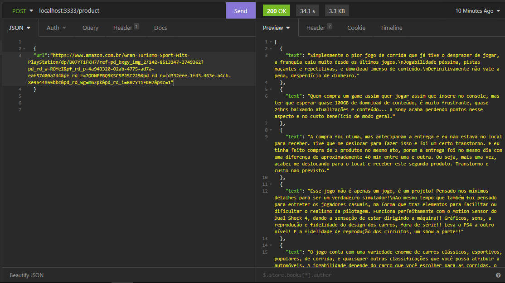

# Amazon-reviews-crawler

Amazon reviews crawler é um micro-serviço desenvolvido com intuito de extrair comentários de produtos da Amazon.

## Clonando o projeto

```bash
git clone https://github.com/gustavors22/amazon-reviews-crawler.git
```

## Instalando dependências 

```bash
yarn install
```

## Executando

```bash
yarn start
```

## Testando


